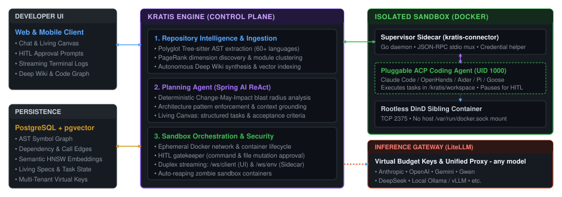

# Kratis

Self-host-friendly, multi-harness agent-orchestration platform for software development, solo - or with a team, web or mobile.

Connect Git repositories, get a living wiki and code graph, plan with an architect agent, then run a pluggable ACP harness in a Docker sandbox. Approve privileged actions, steer a running agent, review the diff, and publish a pull request. Bring your own LLM providers & Keys.

- SDLC process around coding-agents
- Four pillars: Ingest, Plan, Implement, Refine
- Provide agent-steering feedback direct from a diff
- Shipping with 10 ACP agents _(Aider, Claude Code, Codex, Gemini CLI, Goose, Mistral Vibe, OpenCode, OpenHands, Pi, Qwen)_, more to come
- Seamlessly move work across web and mobile - switching where and when makes sense for you. Unblock your agent on-the-go.


## Quick start (self-host)

Requires Docker (x86), curl and openssl. Downloads the compose stack, generates secrets, and starts Kratis:

```bash
mkdir kratis && cd kratis
curl -fsSL https://raw.githubusercontent.com/kratisai/kratis/main/deploy/install.sh | sh
# Check .env and configure
docker compose up -d
# UI and API: http://localhost:8080
```
Then create an account, add your model provider keys, and connect a repository: [`docs/getting-started.md`](docs/getting-started.md).

For further install options, configuration, and commands: [`deploy/README.md`](deploy/README.md).


## Architecture




| Component | Stack | Role |
|-----------|--------|------|
| Control plane | Java 21, Spring Boot 4, virtual threads | REST + JSON-RPC, planning agent, wiki, HITL. Production image embeds the SPA. |
| Web | Vite + React, Tailwind v4, shadcn/ui | SPA. TanStack Query for server state. Zustand for UI and the WebSocket session. |
| Connector | Go (`kratis-connector`) | In-sandbox execution proxy. Speaks JSON-RPC on `/ws/env`. |
| Protocol | JSON-RPC 2.0 schemas | Canonical contract. Drift fails the build. |
| Database | PostgreSQL 16 + pgvector | State, graph, embeddings. Liquibase migrations. |
| Models | LiteLLM | Session-scoped virtual keys, usage, spend. |

WebSockets: `/ws/client` (JWT `auth`) for the UI; `/ws/env` (environment token `env.register`) for the connector. Details: [`docs/knowledge/websocket-api.md`](docs/knowledge/websocket-api.md).


## Development

Prerequisites: Java 21, Docker, Node.js 20+, Go 1.22+, and the parser binaries under `build/bin/` (`codebase-memory-mcp`, `scc`). See [`build/README.md`](build/README.md).

```bash
# API + Postgres + LiteLLM (spring-boot-docker-compose starts compose.yaml)
cd control-plane && ./mvnw spring-boot:run
# http://localhost:8080  — Swagger: /swagger-ui.html

cd web && npm install && npm run dev
# http://localhost:5173
```


## Telemetry

Kratis reports anonymous daily aggregate counts (active teams, repos, executions, and spend). No repository names, user PII, or prompts are sent. See deploy/README.md to disable.
If you send an enquiry, we include your installation ID so we can match deployment diagnostics with your request.

## Docs

Using Kratis:

- [`docs/getting-started.md`](docs/getting-started.md) — first run: account, model keys, repositories, plan, execute, publish
- [`docs/PRD.md`](docs/PRD.md) — what a user can do
- [`deploy/README.md`](deploy/README.md) — install options, environment variables, stack commands

Developers:

- [`AGENTS.md`](AGENTS.md) — conventions, and the validation every change must pass
- [`docs/README.md`](docs/README.md) — index of skills and architecture notes
- [`docs/skills/`](docs/skills/) — task how-tos: WebSocket method, REST endpoint, entity, frontend slice
- [`docs/knowledge/`](docs/knowledge/) — runtime and design reference

Module READMEs: [`control-plane/`](control-plane/README.md), [`web/`](web/README.md), [`sidecar/`](sidecar/README.md), [`protocol/`](protocol/README.md), [`build/`](build/README.md), [`deploy/`](deploy/README.md).

## Next Steps

Feedback, bug reports and feature requests are all incredibly welcome. There is much we've considered adding, and would love to add, but the landscape is evolving quickly, and we're not ready to commit to what comes next. Some ideas include:

- More agent harnesses, and a way to register your own
- Integrations — Slack, MS Teams, Signal, Jira, Linear, Trello, and the issue boards on the supported repository providers
- Sandbox providers beyond Docker, including remote and cloud workspaces
- DevContainer initialisation for the sandbox
- Potentially a separate Enterprise edition (core self-hosting functionality will always remain free and open)


## Security

Please do not open a public issue for a vulnerability. Report it privately through GitHub (**Security → Report a vulnerability**) or to `security@kratis.dev`, and we will confirm it and coordinate a fix.


## License

Apache License 2.0 — see [LICENSE](LICENSE).
