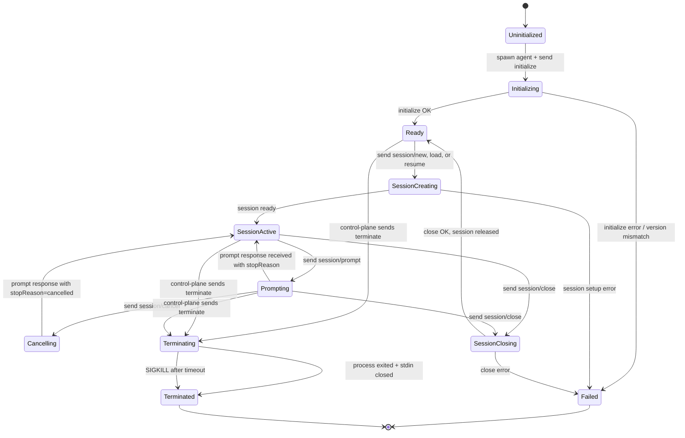
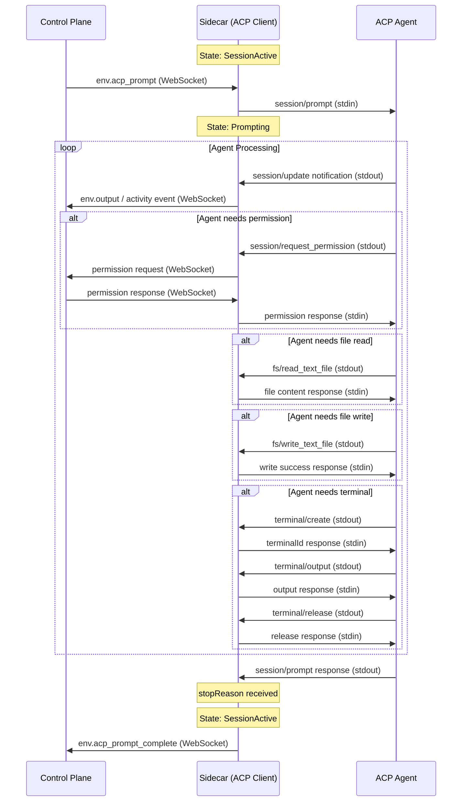

# ACP Client Lifecycle Model & State Machine

This document defines the Kratis lifecycle and state machine for its
**Agent Client Protocol (ACP)** client. The sidecar (`kratis-connector`)
acts as the ACP **Client**, communicating with an ACP **Agent** over stdio
(JSON-RPC 2.0). The control-plane communicates with the sidecar over WebSocket
using an agnostic format (no ACP internals leak to the WebSocket layer).

---

## 1. Architecture Context

```
┌─────────────────┐  stdio (ACP/JSON-RPC 2.0)  ┌───────────────┐
│   ACP Agent     │◄──────────────────────────►│   Sidecar     │
│  (subprocess)   │   stdin/stdout pipes       │  (ACP Client) │
└─────────────────┘                            └──────┬────────┘
                                                      │ WebSocket (JSON-RPC 2.0, agnostic)
                                                      ▼
                                               ┌───────────────┐
                                               │ Control Plane │
                                               │   (Java)      │
                                               └───────────────┘
```

**Key boundary:** ACP types, methods, and semantics exist ONLY on the stdio
link between Agent and Sidecar. The WebSocket link to the control-plane uses
Kratis-native notification/response types (`env.output`, `env.complete`,
`env.acp_initialized`, `env.acp_prompt_complete`, etc.).

---

## 2. ACP Connection States

The sidecar's ACP client progresses through a well-defined set of states.
Kratis manages one ACP session per agent process. Each state has valid
transitions, allowed operations, and error handling.



---

## 3. State Definitions

### 3.1 `Uninitialized`

**Entry:** Process spawned, stdio pipes connected, transport started.

No ACP messages have been sent yet. The client is ready to begin the
handshake.

**Valid transitions:**
- → `Initializing` — client sends `initialize` request

### 3.2 `Initializing`

**Entry:** `initialize` request sent to agent.

The client is waiting for the agent's `initialize` response containing:
- `protocolVersion` — for version negotiation (required)
- `agentCapabilities` — feature support (loadSession, prompt content types,
  MCP transports, session ops, auth)
- `agentInfo` — name, title, version (optional)
- `authMethods` — available authentication schemes (optional, defaults to `[]`)

The client also sends `clientCapabilities` (fs, terminal) and optional
`clientInfo` in the initialize request.

**Valid transitions:**
- → `Ready` — initialize succeeded and capabilities negotiated
- → `Failed` — transport error, version negotiation failure, or malformed response

**Key logic:**
- Version negotiation: agent returns client's version if supported, otherwise
  agent's latest version. Client disconnects if it doesn't support the returned
  version.
- Capabilities are stored for gating later operations (e.g., terminal support,
  fs support, prompt content types).

Authentication and logout are outside this lifecycle. Kratis agents are
pre-authenticated through agent configuration.

### 3.3 `Ready`

**Entry:** Initialize complete. No active session yet.

The client has negotiated capabilities and can create sessions. This is the
idle state between sessions.

**Valid transitions:**
- → `SessionCreating` — client sends `session/new`, `session/load`, or `session/resume`
- → `Terminating` — control-plane requests termination before any session

**Allowed operations:**
- `session/new` — create a new conversation session
- `session/load` / `session/resume` — restore a session if supported
- `session/list` / `session/delete` — manage stored sessions if supported

### 3.4 `SessionCreating`

**Entry:** `session/new`, `session/load`, or `session/resume` request sent.
Updates may arrive while loading session history.

**Valid transitions:**
- → `SessionActive` — session setup succeeds (with `sessionId` from `session/new`)
- → `Failed` — session setup error; Kratis treats this as initialization failure

### 3.5 `SessionActive`

**Entry:** Session created, loaded, or resumed and ready for prompts.

This is the primary operational state. The session has a valid `sessionId`
and the agent is ready to receive prompts.

**Valid transitions:**
- → `Prompting` — client sends `session/prompt`
- → `SessionClosing` — client sends `session/close` (if supported)
- → `Terminating` — control-plane requests termination

**Allowed operations while idle:**
- `session/prompt` — send a user message
- `session/set_mode` — switch agent mode (if modes available)
- `session/set_config_option` — change config (if config options available)
- `session/cancel` — cancel an in-flight prompt (only valid during `Prompting`)
- `session/close` — close the session (if `sessionCapabilities.close` supported)

### 3.6 `Prompting`

**Entry:** `session/prompt` request sent.

The agent is actively processing the prompt. During this state the agent may:
- Stream `session/update` notifications (messages, thoughts, tools, plans,
  commands, mode/config/session metadata, usage)
- Send `session/request_permission` requests (HITL gate)
- Send `fs/read_text_file`, `fs/write_text_file` requests
- Send `terminal/*` requests (create, output, wait, kill, release)

**Valid transitions:**
- → `SessionActive` — prompt response received with a `stopReason`
  (`end_turn`, `max_tokens`, `max_turn_requests`, `refusal`)
- → `Cancelling` — client sends `session/cancel`
- → `SessionClosing` — client sends `session/close` (if supported)
- → `Terminating` — control-plane forces termination

**Critical rules:**
- The client SHOULD continue processing `session/update` notifications even
  after sending `session/cancel`, until the prompt response arrives.
- The agent MUST respond to the original `session/prompt` with
  `stopReason: "cancelled"` after processing the cancel.
- All pending `session/request_permission` requests MUST be answered with
  `outcome: "cancelled"` when cancelling.
- ACP has no mid-turn message-injection primitive, so a steering prompt that
  arrives while a turn is in flight is delivered by interrupting the active
  turn with `session/cancel` (reason `user_interrupted`) and then sending the
  steering content as a follow-up `session/prompt` turn once the agent
  acknowledges the cancel with `stopReason: "cancelled"`.

### 3.7 `Cancelling`

**Entry:** `session/cancel` notification sent to agent.

The client has requested cancellation. The agent should:
1. Stop LLM requests ASAP
2. Abort in-flight tool calls
3. Send any pending `session/update` notifications
4. Respond to the original `session/prompt` with `stopReason: "cancelled"`

**Valid transitions:**
- → `SessionActive` — prompt response received with `stopReason: "cancelled"`

### 3.8 `SessionClosing`

**Entry:** `session/close` request sent.

The agent must cancel any ongoing work and free session resources.

**Valid transitions:**
- → `Ready` — close succeeded, session resources freed
- → `Failed` — close error

### 3.9 `Terminating`

**Entry:** Control-plane sent terminate command, or fatal error detected.

Termination sequence:
1. If session is active and prompting: send `session/cancel` (advisory)
2. If session is active: send `session/close` (if supported)
3. Close stdin (signals EOF to agent)
4. Wait briefly for graceful exit
5. Send `SIGTERM` to process group
6. Wait for exit
7. If still running: `SIGKILL` to process group
8. Wait for stdout/stderr readers to drain
9. Send `env.complete` notification to control-plane

**Valid transitions:**
- → `Terminated` — process exited and all readers drained

### 3.10 `Terminated`

**Entry:** Agent process has exited, all I/O goroutines finished.

This is a terminal state. The sidecar reports the exit code to the
control-plane and awaits further instructions (typically process shutdown).

### 3.11 `Failed`

**Entry:** An unrecoverable error occurred at any stage.

The client sends `env.complete` with a non-zero exit code and an error
message to the control-plane. Cleanup follows the same pattern as
`Terminating` (kill process, drain readers).

---

## 4. ACP Method Reference

### 4.1 Client → Agent Requests

| Method | State Gate | Description |
|--------|-----------|-------------|
| `initialize` | `Uninitialized` | Handshake: negotiate version, exchange capabilities |
| `session/new` | `Ready` | Create a new conversation session |
| `session/load` | `Ready` | Load a session and replay history (if supported) |
| `session/list` | Ready or active | List sessions (if supported) |
| `session/delete` | Ready or active | Delete a listed session (if supported) |
| `session/resume` | `Ready` | Resume without replaying history (if supported) |
| `session/close` | Active or prompting | Cancel work and free session resources (if supported) |
| `session/prompt` | `SessionActive` | Send a user message and process the turn |
| `session/set_mode` | Active or prompting | Switch agent mode |
| `session/set_config_option` | Active session | Change a session config value |

Authentication and logout methods are intentionally out of scope for Kratis.

### 4.2 Client → Agent Notifications

| Method | State Gate | Description |
|--------|-----------|-------------|
| `session/cancel` | `Prompting` | Cancel the in-flight prompt turn |
| `$/cancel_request` | Any | Optional protocol-level request cancellation |

### 4.3 Agent → Client Requests (Sidecar Must Handle)

| Method | Description | Sidecar Action |
|--------|-------------|----------------|
| `fs/read_text_file` | Read a file | Read from sandbox filesystem, return content |
| `fs/write_text_file` | Write a file | Write to sandbox filesystem, return success |
| `session/request_permission` | HITL permission gate | Forward to control-plane via WebSocket, await response |
| `terminal/create` | Create a terminal | Spawn subprocess in sandbox, return terminalId |
| `terminal/output` | Get terminal output | Return buffered output and exit status |
| `terminal/wait_for_exit` | Wait for terminal exit | Block until process exits, return exit status |
| `terminal/kill` | Kill terminal process | Kill without releasing terminalId |
| `terminal/release` | Release terminal | Kill if running, free resources, invalidate terminalId |

### 4.4 Agent → Client Notifications (Sidecar Must Handle)

| Method | Description | Sidecar Action |
|--------|-------------|----------------|
| `session/update` | Stream session progress | Forward to control-plane as `env.output` or structured activity events |

### 4.5 Agent → Client Responses

| Response | Trigger | Key Fields |
|----------|---------|------------|
| `initialize` result | `initialize` request | `protocolVersion`; optional capabilities, info, auth methods |
| `session/new` result | `session/new` request | `sessionId`, `modes`, `configOptions` |
| load/resume result | load/resume request | `modes`, `configOptions` |
| list result | `session/list` request | `sessions`, `nextCursor` |
| config result | `session/set_config_option` | full `configOptions` |
| `session/prompt` result | `session/prompt` request | `stopReason` |
| Empty result | delete/close/set-mode | success |
| Error result | Any request failure | `error.code`, `error.message` |

---

## 5. Prompt Turn Lifecycle (Detailed)

The prompt turn is the most complex interaction pattern in ACP. This section
details the message flow.



### 5.1 Stop Reasons

| Stop Reason | Meaning |
|-------------|---------|
| `end_turn` | Agent completed the turn normally |
| `max_tokens` | Agent hit token limit |
| `max_turn_requests` | Agent hit max inter-turn request count |
| `refusal` | Agent refused to continue |
| `cancelled` | Client cancelled via `session/cancel` |

---

## 6. Cancellation Rules

1. `session/cancel` is a **notification** (no response expected).
2. After sending `session/cancel`, the client MUST answer pending
   `session/request_permission` requests with `outcome: "cancelled"` and wait
   for the prompt response with `stopReason: "cancelled"`. It SHOULD continue
   processing final `session/update` notifications.
3. The agent SHOULD:
   - Stop LLM requests ASAP
   - Abort in-flight tool calls
   - Send any final `session/update` notifications before responding
4. `$/cancel_request` cancels a specific JSON-RPC request by ID. The receiver
   MAY cancel the activity and MUST respond with error code `-32800`
   (Cancelled) or a valid response with partial data.

---

## 7. Error Handling

### 7.1 JSON-RPC Error Codes

| Code | Meaning | Client Action |
|------|---------|---------------|
| `-32700` | Parse error | Log and continue; agent received malformed JSON |
| `-32600` | Invalid request | Check request format |
| `-32601` | Method not found | Agent doesn't implement this method; check capabilities |
| `-32602` | Invalid params | Check parameter types and required fields |
| `-32603` | Internal error | Agent internal failure; may be transient |
| `-32800` | Request cancelled | Expected after `$/cancel_request` |
| `-32000` | Authentication required | Fail initialization; agent was not pre-authenticated |
| `-32002` | Resource not found | File or resource doesn't exist |

### 7.2 Transport Errors

- **stdin write failure:** Agent process likely exited; transition to `Terminating`
- **stdout read failure:** Agent process likely exited; transition to `Terminating`
- **Response timeout (15s default):** Log error, consider agent unresponsive;
  may need to escalate to `Terminating`. Applies to steady-state requests
  (`session/prompt`, `session/close`, fs/terminal ops, etc.).
- **Handshake timeout (30s default):** The launch handshake (`initialize` and
  `session/new`) uses a separate, more generous timeout to accommodate agent
  cold-start, when the process may legitimately take longer than a steady-state
  request to answer.

---

## 8. Capability Gating

The client MUST check advertised capabilities before using optional features.
Text prompts, resource links, and stdio MCP servers are baseline support:

| Capability | Gates |
|-----------|-------|
| `agentCapabilities.loadSession` | `session/load` |
| `agentCapabilities.sessionCapabilities.list` | `session/list` |
| `agentCapabilities.sessionCapabilities.delete` | `session/delete` |
| `agentCapabilities.sessionCapabilities.resume` | `session/resume` |
| `agentCapabilities.sessionCapabilities.close` | `session/close` |
| `agentCapabilities.sessionCapabilities.additionalDirectories` | Additional session roots |
| `agentCapabilities.mcpCapabilities.http` / `.sse` | HTTP/SSE MCP servers |
| `agentCapabilities.promptCapabilities.image` | Include `ContentBlock::Image` in prompts |
| `agentCapabilities.promptCapabilities.audio` | Include `ContentBlock::Audio` in prompts |
| `agentCapabilities.promptCapabilities.embeddedContext` | Include `ContentBlock::Resource` in prompts |
| `clientCapabilities.fs.readTextFile` | Agent can call `fs/read_text_file` |
| `clientCapabilities.fs.writeTextFile` | Agent can call `fs/write_text_file` |
| `clientCapabilities.terminal` | Agent can call `terminal/*` methods |

---

## 9. Sidecar-to-Control-Plane WebSocket Mapping

The sidecar translates ACP events into Kratis-native WebSocket messages:

| ACP Event | WebSocket Notification |
|-----------|----------------------|
| Agent stdout line (non-JSON protocol violation) | `env.output` with `stream: "stdout"` |
| Agent stderr line | `env.output` with `stream: "stderr"` |
| `initialize` + `session/new` complete | `env.acp_initialized` with `sessionId`, `agentName`, `agentVersion` |
| `session/update` (all variants) | `env.output` or structured `env.activity` events |
| `session/request_permission` | Permission request via WebSocket, await response |
| `session/prompt` response with stopReason | `env.acp_prompt_complete` with `stopReason` |
| Agent process exit | `env.complete` with `exitCode` |
| Launch failure | `env.complete` with `exitCode: -1` |

### 9.1 `session/update` relay model

Every `session/update` discriminator has an explicit relay path (terminal line,
activity event, or captured metadata) as defined by the matrix below. The JSON-RPC
envelope is never mirrored into `env.output`; only parsed, harness-agnostic fields
are relayed.

| `sessionUpdate` | Terminal relay | Activity relay |
|-----------------|----------------|----------------|
| `user_message_chunk` | `[User] <text>` | `MESSAGE` (role `user`), keyed by the chunk-run key |
| `agent_message_chunk` | `[Agent] <text>` | `MESSAGE` (role `agent`), keyed by the chunk-run key |
| `agent_thought_chunk` | `[Thought] <text>` | `THINKING`, keyed by the chunk-run key |
| `tool_call` | `[Tool] <title> (<status>)` | one per lifecycle transition, keyed by `toolCallId` |
| `tool_call_update` | delta-emitted output; status-only transitions print `[Tool] <title> (<status>)` | one per lifecycle transition, keyed by `toolCallId` |
| `plan` | `[Plan] Agent plan updated` | `PLAN` with structured `detail.plan` (`PlanEntry[]`, replace-all), unique `plan-<n>` actionId per snapshot |
| `current_mode_update` | `[Mode] Changed to: <id>` | `THINKING` |
| `config_option_update` | `[Update] config_option_update` | captured as session metadata |
| `usage_update` | — | captured as session metadata |
| `session_info_update` | — | captured as session metadata |
| `available_commands_update` | — | captured as session metadata |
| unknown / future | `[Update] <type>` | `THINKING` with `detail.rawUpdate` capture |

Message and thought chunks are grouped into **chunk runs**: one contiguous run
of same-kind chunks is one activity. The run owns its `actionId` (the run key)
from open to close:

- Run 1 of an ACP `messageId` uses that `messageId` as its key.
- Run *n* ≥ 2 of the same `messageId` (the id may return after an
  interruption, e.g. `thought → tool → thought`) uses `<messageId>#<n>`.
  Continuity is not identity: each run is its own activity.
- ACP `messageId` is optional. When an agent omits it, the sidecar mints
  `inferred-<n>` from a monotonic counter; each new inferred run gets a fresh
  key.
- `detail.messageId` always carries the raw ACP `messageId` (empty when
  absent) — never the run key.

A run ends, and the sidecar emits its accumulated text with status
`completed`, when any of these arrives: a chunk of a different stream kind, a
chunk with a different `messageId` (including present-vs-absent), any
non-chunk `sessionUpdate` (`tool_call`, `tool_call_update`, `plan`,
`current_mode_update`, unknown), or the end of the prompt turn. Metadata-only
updates (`usage_update`, `session_info_update`, `available_commands_update`,
`config_option_update`) do not end a run. Chunk activity emissions carry
**cumulative** run text, throttled to at most one per 250 ms or per 512 new
bytes, and always at the run boundary; downstream layers replace, never
concatenate. The terminal relay (`[Agent]`/`[Thought]` lines) stays on every
delta. Every open/key/close decision is logged with the `[ACP][MSGID]` prefix
(always in the sidecar log, in `env.output` only under `--debug`).

ACP `plan` updates are replace-all per update (the agent sends the complete
entry list) and Kratis displays every update as a fresh activity in the
log history. Unknown priority/status values fall back to the schema defaults 
(medium/pending); content-less entries are dropped.

`TodoWrite` is mapped to the same plan path by two mechanisms. claude-agent-acp
bridges its `TodoWrite` tool into `session/update` plan events, which the plan 
path handles directly. Some agents (inc. OpenCode) instead emit `TodoWrite` as 
a plain tool call: the sidecar detects the todo list in `rawInput.todos`, and 
falls back to a tool named with "todo" whose result parses as a JSON entry array,
relaying the call as a `PLAN` activity. Both harness styles render as plan 
activities in the UI.

### 9.2 `env.activity` wire format

Each activity carries the lifecycle `status` (`pending | in_progress | completed |
failed`) and a structured `detail` bag (tool kind/title/locations, input params,
output text, diff, exit code, approval state, messageId, harness `_meta`
preserved verbatim). Activities sharing an `actionId` (ACP `toolCallId` for
tools, the chunk-run key for message/thought runs; see §9.1) are exactly one
activity record in the UI and one row per execution in the control plane
(enforced by the `(execution_id, action_id)` unique index). Chunk emissions
carry cumulative text, so both layers replace the description on merge and
never concatenate. The ACP `_meta` extension bag (chunk-level and
content-block-level) is preserved
verbatim in `detail.meta` and never parsed for behavior; the full raw update
payload is preserved in `detail.rawUpdate` for post-hoc debugging. One
negotiated exception: the `_meta.terminal_output` capability advertised in
`initialize` opts into the agent-owned terminal relay shared by codex-acp and
claude-agent-acp — `_meta.terminal_info` announces a terminal,
`_meta.terminal_output` appends transcript chunks (delta semantics), and
`_meta.terminal_exit` finalizes it with the exit code. The sidecar accumulates
these into the tool call's `detail.output` (persisted for replay) and relays the
chunks live to `env.output`, buffering them per `terminal_id` when they arrive
before the announcing `tool_call` (see `applyTerminalMetaLocked` in
[`update.go`](../../sidecar/acp/update.go)).

Message/thought streams carry their own `completed` transition: the sidecar
closes a chunk run at its boundary and emits the accumulated text with the
terminal status (§9.1). The control plane and the web UI only record and
render what arrives — no layer closes a stream because a different activity
started. When the execution completes, all remaining open activities are
completed as a backstop, so replay shows the same terminal statuses as the
live stream.

---

## 10. Current Sidecar Implementation Assessment

The sidecar code implements the core ACP lifecycle through the `AgentSupervisor`
in [`supervisor.go`](../../sidecar/runner/supervisor.go), which owns the complete
agent process lifecycle:

**Implemented:**
- Explicit state machine with all states (`Uninitialized` → `Initializing` → `Ready` → `SessionCreating` → `SessionActive` → `Prompting` → `Cancelling` → `SessionClosing` → `Terminating` → `Terminated` → `Failed`)
- Process spawn and stdio transport ([`transport.go`](../../sidecar/acp/transport.go))
- `initialize` handshake with version negotiation (owned by `supervisor.Launch()`)
- `session/new` to create a session (owned by `supervisor.Launch()`)
- `session/prompt` to send prompts (owned by `supervisor.Prompt()`)
- `session/close` during termination (owned by `supervisor.CloseSession()`)
- `session/cancel` as a notification (no `id` field) during terminate
- Termination sequence (cancel permissions → session/cancel → session/close → stdin close → SIGTERM → SIGKILL)
- Notification handling for `session/update`, `session/request_permission`
- Terminal operations (`terminal/*`)
- Filesystem operations (`fs/*`)
- Auto-incrementing request IDs via transport layer
- Race condition handling for concurrent operations (disconnect, exit, terminate, permission cancellation)

Authentication and logout are intentionally out of scope; agents must be
pre-authenticated through Kratis agent configuration.

**Implementation gaps for the supported lifecycle:**
1. No `session/load`, `session/resume`, `session/list`, `session/delete` (intentionally deferred until product requires persistent sessions)
2. No `session/set_mode` or `session/set_config_option` (intentionally deferred)
3. No optional `$/cancel_request` handling (intentionally deferred)
4. No capability gating on outbound operations (intentionally deferred; baseline operations are always supported)

---

## 11. Recommended State Machine Implementation

For a robust implementation, the sidecar should maintain an explicit state
machine with the following properties:

1. **Single source of truth:** An `AcpState` enum field on the session struct
2. **Transition validation:** Each operation checks the current state before
   proceeding; invalid transitions return errors
3. **Thread safety:** State transitions are protected by the existing mutex
4. **Event-driven:** State transitions emit events that map to WebSocket
   notifications
5. **Idempotent termination:** `Terminating` state can be entered from any
   state and is safe to call multiple times

```go
type AcpState int

const (
    StateUninitialized AcpState = iota
    StateInitializing
    StateReady
    StateSessionCreating
    StateSessionActive
    StatePrompting
    StateCancelling
    StateSessionClosing
    StateTerminating
    StateTerminated
    StateFailed
)
```
