# Chat Interaction Architecture & Sequence Design

## Overview

The Kratis AI platform provides a real-time, deterministic, dual-transport (REST + WebSocket) interface for user-agent interactions. The architecture guarantees absolute sequence consistency, zero-loss message history, and seamless late-join stream attachment for all real-time events—including chat text chunks, agent thinking/tool-call telemetry, sandbox execution updates, and Human-in-the-Loop (HITL) permission requests.

---

## Core System Invariants

### 1. Synchronous Persistence & Transactional Commitment
- **Immediate Persistence**: When a chat is created (via REST `POST /api/v1/chats`) or a follow-up message is submitted (via WebSocket `chat.send`), the user prompt **MUST** be written to PostgreSQL and committed within a synchronous database transaction **BEFORE** returning an HTTP response or issuing a WebSocket acknowledgement to the client.
- **Race Condition Prevention**: Synchronous transaction commitment ensures that any subsequent WebSocket `chat.subscribe` request—even if received milliseconds after HTTP 202—will read the newly persisted user prompt from the database.

### 2. Multi-Subscriber Replay & Unified Hot Stream
- **Registry Pattern**: In-progress agent executions expose a hot reactive stream (`Flux<ClientPayload.ChatStreamPayload>`) registered in `ChatFluxRegistry` keyed by `chatId`.
- **Multicast Replay Sink**: The agent execution stream utilizes a multicast replay sink (`Sinks.many().replay().all()`). All events emitted during an execution loop are stored in the replay buffer.
- **Full Stream Coverage**: All active subscribers—including primary tabs, secondary tabs, or late-joining clients—receive the full spectrum of live events:
  1. Assistant response text chunks (`message_chunk`)
  2. Agent thinking and tool-call lifecycle events (`telemetry`)
  3. Sandbox process lifecycle and output logs (`execution_activity`, `execution_output`, `execution_status_changed`, `execution_complete`)
  4. Human-in-the-Loop permission requests and resolutions (`execution_hitl_required`, `execution_hitl_resolved`)
  5. Interactive canvas document creations and updates (`canvas`)
  6. Terminal chat failures (`chat_error`) emitted in-band when the agent loop fails, so every subscriber can close out the turn instead of leaving it dangling
- **Automatic Lifecycle Cleanup**: The stream registry automatically removes the `chatId` entry when the reactive stream terminates (`onComplete`, `onError`, or `cancel`).

### 3. Payload Type Differentiation
WebSocket JSON-RPC payloads strictly differentiate historical replays, live text chunks, telemetry/tool events, execution logs, and HITL permission gates:

| Payload `type` | Payload Class / Record | Description |
| :--- | :--- | :--- |
| `message` | `MessageResult` | Represents a complete historical or replayed message (e.g., user prompt, system prompt, or completed assistant response). |
| `message_chunk` | `MessageChunkResult` | Incremental streaming token or text fragment emitted live during assistant response generation. |
| `telemetry` | `TelemetryResult` | Agent thinking thoughts (`status`) and tool execution lifecycle (`ToolStart`, `ToolComplete`, `ToolError`). |
| `execution_activity` | `ExecutionActivityResult` | High-level execution lifecycle steps (e.g. sandbox spawn, git clone / git init, command launch). |
| `execution_output` | `ExecutionOutputResult` | Real-time stdout / stderr log lines emitted during sandbox execution. |
| `execution_hitl_required` | `ExecutionHitlRequiredResult` | **HITL Request**: Emitted when a command requires user approval before execution. |
| `execution_hitl_resolved` | `ExecutionHitlResolvedResult` | **HITL Resolution**: Broadcast when an admin/user approves or denies an execution request. |
| `execution_status_changed` | `ExecutionStatusChangedResult` | Execution state change (status transition, creation, or usage refresh) for a chat's executions. Receivers invalidate the `['chat-executions', chatId]` TanStack Query cache so the status badge, terminate menu, and usage summary refetch from the backend — the single source of truth. Usage refreshes are leading-edge throttled per execution (`kratis.litellm.usage-refresh-interval`, default 15s): the first agent activity/output event refreshes immediately, and activity during the trailing window sets a flag so one catch-up refresh runs at window end — continuous work yields periodic updates without a refresh per event; a final refresh is emitted at completion. Logs/activities are not part of this signal — they live only in the execution store, keyed by `executionId`. |
| `execution_complete` | `ExecutionCompleteResult` | Signals completion and exit code of a sandbox execution run. |
| `canvas` | `CanvasResult` | Document creation, updates, section edits, and soft-deletes in the chat canvas workspace. Create/Update events carry `canvasType` (`SPEC`/`DOCUMENT`), a display `repoLabel`, and `isNewRepo`; only `SPEC` canvases can be launched. A `Delete` event carries only `documentId` + `chatId` and is broadcast to team subscribers when a user soft-deletes a document via `DELETE /api/v1/chats/{chatId}/canvas/documents/{documentId}`; soft-deleted documents are excluded from `chat.subscribe` replay, agent canvas tools, and launch validation, and rewriting a deleted `documentId` is blocked. |
| `complete` | `CompleteResult` | Signals completion of history replay (when `chatId` is present) or completion of live stream generation (when `messageId` is present). |
| `chat_error` | `ChatErrorResult` | Terminal in-band failure for a chat turn. Carries `code` and a user-facing `message`; the failure is also persisted as an error-marked assistant message so a reload still surfaces it. Codes: `MAX_ITERATIONS_EXCEEDED` (`-32008`) when the ReAct loop exhausts its turn budget, `RATE_LIMIT_EXCEEDED` (`-32005`) for quota/rate-limit exhaustion, `LLM_AUTHENTICATION_FAILED` (`-32010`) for invalid/revoked provider credentials or permission denials, `LLM_CONTEXT_LENGTH_EXCEEDED` (`-32011`) when the conversation exceeds the model context window, and `LLM_PROVIDER_NOT_FOUND` (`-32006`) for unknown models. |

### 4. ReAct Loop Failure Classification
The shared `ReActLoop` aborts immediately on **non-recoverable provider failures** instead of retrying the same doomed request until its iteration budget is spent:
- `LlmExceptionClassifier` maps provider/transport exceptions onto an `LlmErrorCategory` by walking the cause chain for typed SDK/Spring-AI/Spring-Web errors carrying an HTTP status, then falls back to LiteLLM/OpenAI error-body phrases.
- **Fatal categories** throw `ReActLoopFatalException`, which callers surface as a `chat_error` (planning agent) or a failed ingestion batch (`GENERATE_WIKI`, `RESEARCH_PATTERNS`).
- **Transient categories** retry in `invokeLlm` with bounded exponential backoff (3 attempts); the error is **not** appended to the system prompt, since the model cannot fix a transport failure. A transient error that strikes after partial output was already streamed aborts rather than re-streaming duplicate chunks.
- Structured-output validation failures and tool-call errors remain model-correctable and keep using the existing feedback loop.

### 4. Client State Determinism & Event Dispatching
- **ID-Based Merging**: Client state stores messages in a dictionary keyed by `chatId`, where messages are merged using unique message identifiers (`messageId` or DB primary keys).
- **Direct Store Updates**: Replayed messages directly hydrate or merge into the state store without artificial delay buffers or load accumulators.
- **Chunk Aggregation**: Streaming chunks (`type: "message_chunk"`) accumulate incrementally into the active assistant message identified by `messageId`.
- **Telemetry & Activity Routing**:
  - `telemetry` events route to `TelemetryStore` to display live thinking indicators and tool activity cards.
  - `execution_*` and HITL permission events route to `ExecutionStore` and `ActivityStore` to trigger approval dialogs and stream sandbox logs.

---

## Interaction Sequences

### 1. New Chat Creation & Full Multicast Stream Flow

When a user initiates a chat that invokes tools, sandbox execution, and HITL permission approval:

```mermaid
sequenceDiagram
    autonumber
    actor Client as Web UI (React/Zustand)
    participant REST as REST ChatController
    participant Service as PlanningAgentService
    participant Reg as ChatFluxRegistry
    participant Agent as PlanningAgentLoop
    participant DB as Postgres DB
    participant WS as WS SubscribeHandler

    Client->>REST: POST /api/v1/chats {teamId, providerId, modelName, message}
    
    rect rgb(50, 50, 50)
        Note over REST,DB: Transactional Persistence Boundary
        REST->>DB: Create ChatEntity & save UserMessage
        DB-->>REST: Transaction Committed
    end

    REST->>Service: streamMessage(chatId, userQuery)
    Service->>Agent: Spawn ReAct Loop (agentTaskExecutor)
    Service-->>REST: Return Hot Multicast Replay Flux
    REST->>Reg: register(chatId, flux)
    REST-->>Client: HTTP 202 Accepted {id: chatId}

    Note over Client: Client navigates to /chats/:id & calls chat.subscribe

    Client->>WS: WS "chat.subscribe" {chatId, teamId}
    WS->>DB: Query persisted history by chatId
    DB-->>WS: [UserMessage]
    WS->>Client: WS JsonRpcResponse {type: "message", role: "user", content: "..."}
    WS->>Client: WS JsonRpcResponse {type: "complete", chatId, messageCount: 1}

    WS->>Reg: get(chatId)
    Reg-->>WS: Active Multicast Flux
    
    Note over Agent,Client: Live Agent Stream (All Subscribers Receive Events)
    Agent->>WS: JsonRpcResponse {type: "telemetry", event: {status: "Thinking about plan..."}}
    WS->>Client: Stream Thinking Indicator
    
    Agent->>WS: JsonRpcResponse {type: "telemetry", event: {toolName: "execute_command", status: "ToolStart"}}
    WS->>Client: Stream Tool Start Notification
    
    Agent->>WS: JsonRpcResponse {type: "execution_hitl_required", command: "rm -rf /tmp/build"}
    WS->>Client: Render HITL Permission Approval Dialog
    
    Client->>WS: REST POST /api/v1/hitl/resolve {executionId, hitlId, response}
    WS->>Agent: Resolve Permission Gate
    
    Agent->>WS: JsonRpcResponse {type: "execution_output", line: "Cleaning build directory..."}
    WS->>Client: Stream Execution Output Line
    
    Agent->>WS: JsonRpcResponse {type: "message_chunk", content: "I have cleaned..."}
    Agent->>WS: JsonRpcResponse {type: "message_chunk", content: " the build workspace."}
    WS->>Client: Stream Assistant Response Tokens

    Agent->>DB: Save Assistant Message
    Agent->>Reg: Complete Flux (Auto-removes chatId)
    WS->>Client: WS JsonRpcResponse {type: "complete", messageId}
```



---

### 2. Multi-Subscriber / Late-Joiner Stream Replay

When a second browser tab joins an in-progress execution stream mid-way:

```mermaid
sequenceDiagram
    autonumber
    actor Tab1 as Client Tab 1 (Active)
    actor Tab2 as Client Tab 2 (Late Joiner)
    participant WS2 as WS SubscribeHandler (Tab 2)
    participant Reg as ChatFluxRegistry
    participant DB as Postgres DB

    Note over Tab1,Reg: Execution in progress. Chunks 1-3, Telemetry, and HITL events already emitted to Tab 1.

    Tab2->>WS2: WS "chat.subscribe" {chatId}
    WS2->>DB: Query persisted history
    DB-->>WS2: [UserMessage]
    WS2->>Tab2: WS {type: "message", role: "user", content: "..."}
    WS2->>Tab2: WS {type: "complete", chatId, messageCount: 1}

    WS2->>Reg: get(chatId)
    Reg-->>WS2: Multicast Replay Flux

    rect rgb(60, 60, 60)
        Note over WS2,Tab2: Immediate Replay Buffer Delivery for Tab 2
        WS2->>Tab2: WS {type: "telemetry", event: {status: "Thinking..."}}
        WS2->>Tab2: WS {type: "execution_hitl_required", command: "..."}
        WS2->>Tab2: WS {type: "message_chunk", content: "Token 1..."}
        WS2->>Tab2: WS {type: "message_chunk", content: "Token 2..."}
    end

    Note over Tab1,Tab2: Live Sync (Both Tabs Receive Incoming Token 3 Simultaneously)
    Reg->>Tab1: WS {type: "message_chunk", content: "Token 3..."}
    Reg->>Tab2: WS {type: "message_chunk", content: "Token 3..."}
```



---

## Data Models & Protocol Contracts

### JSON-RPC Response Contracts

#### Thinking & Telemetry Notification (`type: "telemetry"`)
```json
{
  "jsonrpc": "2.0",
  "id": 4,
  "result": {
    "type": "telemetry",
    "event": {
      "status": "Analyzing codebase context for dependency updates...",
      "taskId": "task-789",
      "toolName": "ast_grep_search",
      "statusType": "ToolStart"
    }
  }
}
```

#### HITL Request (`type: "execution_hitl_required"`)
```json
{
  "jsonrpc": "2.0",
  "id": 4,
  "result": {
    "type": "execution_hitl_required",
    "executionId": "e1f2a3b4-5678-90ab-cdef-1234567890ab",
    "hitlId": "tool-call-42",
    "kind": "approval",
    "message": "Allow docker run --rm -v /workspace:/app golangci-lint run?",
    "command": "docker run --rm -v /workspace:/app golangci-lint run"
  }
}
```

#### Sandbox Execution Log Line (`type: "execution_output"`)
```json
{
  "jsonrpc": "2.0",
  "id": 4,
  "result": {
    "type": "execution_output",
    "executionId": "e1f2a3b4-5678-90ab-cdef-1234567890ab",
    "line": "[golangci-lint] 0 issues found.",
    "stream": "stdout"
  }
}
```

#### Streaming Assistant Chunk Payload (`type: "message_chunk"`)
```json
{
  "jsonrpc": "2.0",
  "id": 4,
  "result": {
    "type": "message_chunk",
    "chatId": "0ed81e23-cf2a-44e1-b310-07daae5e49eb",
    "messageId": "assistant-456",
    "role": "assistant",
    "content": "All linter checks passed cleanly.",
    "timestamp": "2026-07-26T15:00:01Z"
  }
}
```
