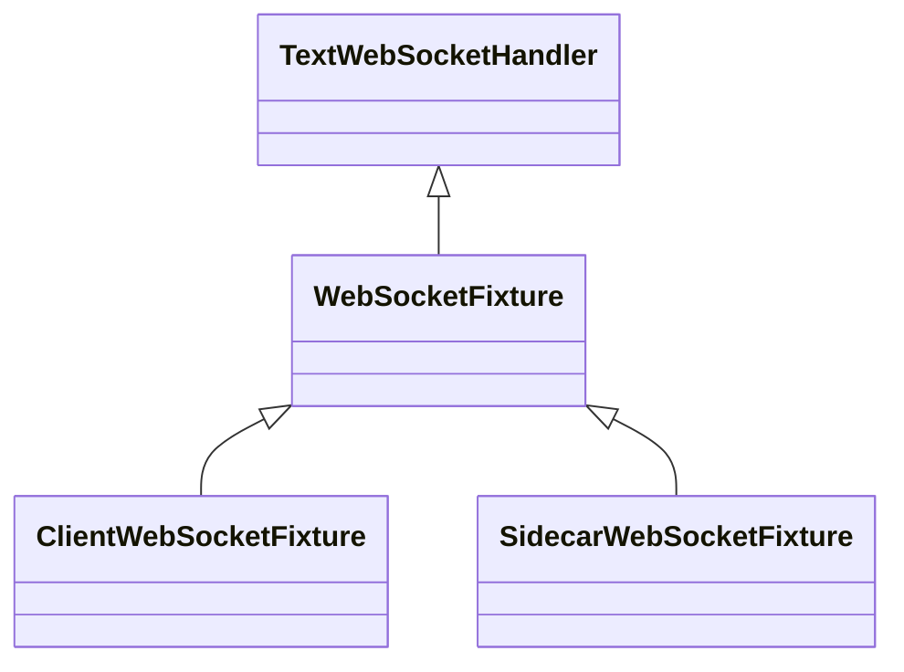

**CRITICAL**: Expanding/adding Automated testing is mandatory.  ALWAYS UPDATE THE TESTS

## Test Classification

To ensure clarity and maintainability, tests in the control plane are classified into distinct categories based on their scope and what they verify:

| Test Type | Naming Convention | Scope & Characteristics |
|-----------|-------------------|-------------------------|
| **Unit Test** | `*Test.java` | Tests a single class or method in complete isolation. No Spring context, no database. Uses plain JUnit and Mockito. |
| **Component Test** | `*ComponentTest.java` | Tests a single component or service. May use the Spring context (`@SpringIntegrationTest`) and a real database, but **mocks external boundaries** (e.g., `ChatModel`, `ProcessExecutor`, external HTTP clients) to isolate the component's orchestration logic. |
| **Integration Test** | `*IntegrationTest.java` | Tests significant multi-component interactions. May mock some external boundaries, but validates the wiring and state transitions across multiple services (e.g., async queueing, concurrency, complex database row-locking). **OR** tests that interact with **real external systems/binaries** (e.g., native `codebase-memory-mcp` binary execution, real WebSocket connections). |
| **E2E Test** | `*E2ETest.java` | Tests the full system from the external boundary (e.g., HTTP REST API or WebSocket) down to the database, using realistic fakes or recorded responses to simulate the entire user journey. |

> [!IMPORTANT]
> Do not name a test `*IntegrationTest.java` if it only tests a single service with heavily mocked external dependencies. Use `*ComponentTest.java` instead. Reserve `*IntegrationTest.java` for tests that validate complex multi-component interactions or real external binary execution.

## Unified Integration Testing (`@SpringIntegrationTest`)

Instead of writing custom `@SpringBootTest` boilerplate, all integration tests should use the unified `@SpringIntegrationTest` annotation. It automatically configures the active `test` profile, boots the Testcontainers PostgreSQL singleton, and boots common mocks (`FakeChatModelConfig`, `ModelDiscoveryTestConfig`, `ProcessExecutorTestConfig` spy, `FakeGitHubApiClientConfig`, `FakeGitLabApiClientConfig`) and database utility (`DatabaseCleaner`).

| Layer | Location | Pattern |
|-------|----------|---------|
| Controller integration | `control-plane/src/test/java/.../controller/<Resource>ControllerTest.java` | `@SpringIntegrationTest` + `@Transactional` + `MockMvc` |
| Service integration | `control-plane/src/test/java/.../service/<Resource>IntegrationTest.java` | `@SpringIntegrationTest` + `@Transactional` or manual `DatabaseCleaner` |
| WebSocket integration | `control-plane/src/test/java/.../websocket/*IntegrationTest.java` | `@SpringIntegrationTest` (already `RANDOM_PORT`) + `WebSocketFixture` |
| Entity mapping | `control-plane/src/test/java/.../repository/<Resource>MappingTest.java` | `@SpringIntegrationTest` + `@Transactional` |

### Key Infrastructure Components Wired by `@SpringIntegrationTest`:
1. **`TestDataFactory`**: Autowire this to create teams, users, repositories, and authentication contexts. Prefer `createAuthenticatedContext()` (JWT + `gpt-4o` provider, no LiteLLM) or `createProvisionedContext()` (same + LiteLLM provision) plus `createChat(...)` over HTTP register/login. Keep HTTP register/login only in `AuthControllerTest`.
2. **`DatabaseCleaner`**: Autowire this to clean up standard database tables between tests (crucial for non-transactional integration test classes).
3. **`FakeChatModelConfig`**: Provides global mocks for LLM services (`ChatModel` and `EmbeddingModel`)
   - Do not use Mockito to mock `ChatModel`. Instead, inject `FakeChatModel` and use `PromptMatcher`s to define expected behavior.
   - Always call `fakeChatModel.reset()` in `@BeforeEach` to ensure test isolation.
   - Use `fakeChatModel.addMatcher(PromptMatcher.builder()...)` to define specific responses.
   - Use `maxMatches(1)` to ensure a matcher is only consumed once, preventing accidental reuse across multiple calls.
   - For common ingestion pipeline scenarios, reuse shared matchers from `FakeChatModelMatchers` (e.g., `FakeChatModelMatchers.ingestionPipelineMatchers()`).
   - Define test-specific matchers directly in the test class unless they are common across at least two test classes.
4. **`ModelDiscoveryTestConfig`**: Replaces the production `ModelDiscoveryClient` with an identical declarative HTTP-interface client built over a **dedicated** `modelDiscoveryRestTemplate` `RestTemplate` bean. It never touches the network and never mutates the shared application `RestTemplate`.
   - To stub model-discovery calls, bind a `MockRestServiceServer` to the dedicated `modelDiscoveryRestTemplate` bean in `@BeforeEach`:
     ```java
     @Autowired @Qualifier("modelDiscoveryRestTemplate") private RestTemplate modelDiscoveryRestTemplate;
     private MockRestServiceServer modelDiscoveryServer;

     @BeforeEach
     void setUp() {
         modelDiscoveryServer = MockRestServiceServer.bindTo(modelDiscoveryRestTemplate).build();
     }
     ```
   - Stub the provider-specific URL, method, and auth headers and `verify()` after the call, e.g.:
     ```java
     modelDiscoveryServer.expect(requestTo("https://api.anthropic.com/v1/models"))
             .andExpect(method(HttpMethod.GET))
             .andExpect(header("x-api-key", "sk-test-key"))
             .andExpect(header("anthropic-version", "2023-06-01"))
             .andRespond(withSuccess("{\"data\":[{\"id\":\"claude-3-5-sonnet-20241022\"}]}", MediaType.APPLICATION_JSON));
     ```
   - Do NOT bind `MockRestServiceServer` to the shared application `RestTemplate`: binding permanently replaces its request factory and the intercepting factory lingers after the test class finishes, poisoning other tests in the same context slot. Use the dedicated bean so interception is contained.
   - MockRestServiceServer cannot intercept cross-process traffic (LiteLLM container, sandboxed ACP agents) — those flows use `WireMockLlmServer` instead.
   - `WireMockLlmServer` registers **no default stubs**. Tests opt into SDK pre-flight GET stubs via `LlmMockScenarios` presets (e.g. `LlmMockScenarios.mistral(server)`, `LlmMockScenarios.gemini(server)`, `LlmMockScenarios.openAiCompat(server)`) and register POST response matchers via `HttpRequestMatcher` + `LlmResponseBuilders`. Each E2E test applies the preset for its single upstream solution in `configureWireMockScenario()`.

***

## Controller Integration Tests

Use `@SpringIntegrationTest` with real database access and `MockMvc`. Get an
authenticated context from `TestDataFactory` (`createAuthenticatedContext()` /
`createProvisionedContext()`) rather than registering and logging in by hand. Clean
the database with `DatabaseCleaner`, not `repository.deleteAll()`.

### Required Test Cases Per Endpoint

| Endpoint Type | Required Tests |
|---------------|----------------|
| POST (create) | Happy path (201), validation failure (400), duplicate conflict (409), unauthenticated (403) |
| GET (list) | Happy path (200), empty list, unauthenticated (403) |
| GET (single) | Happy path (200), not found (404), forbidden (403) |
| PUT (update) | Happy path (200), not found (404), validation failure (400) |
| DELETE | Happy path (204), not found (404), forbidden (403) |

### Key Lessons

1. **Test ALL endpoints** — Don't skip CRUD endpoints. Every GET/PUT/DELETE needs a test.
2. **Use real DB** — Controller tests hit the real database via `@Transactional`. Don't mock services at this layer.
3. **Use `TestDataFactory`** — Get an authenticated context instead of a hand-rolled register/login helper.
4. **Test team member endpoints** — `POST /{id}/members` and `DELETE /{id}/members/{userId}` are commonly missed.
5. **ALWAYS add `@Transactional` to `@SpringIntegrationTest` integration tests** — Without it, async workers (e.g. `@Async` methods) commit data that persists after the test, causing test pollution. Subsequent tests will fail with foreign key constraint violations when they try to clean up. This is especially critical when tests trigger async ingestion workers, background tasks, or any `@Async` service methods.

## Service Unit Tests

Use plain JUnit for service layer tests. No `@SpringBootTest` unless the service has complex Spring integration.

```java
class ChatServiceTest {
    private ChatService chatService;

    @BeforeEach
    void setUp() {
        chatService = new ChatService();
    }

    @Test
    void sendMessage_shouldDeliverChunks() throws InterruptedException {
        List<ResponseChunk> chunks = new ArrayList<>();
        CountDownLatch latch = new CountDownLatch(1);

        chatService.sendMessage("user-1", "test", chunk -> {
            chunks.add(chunk);
            if (chunk.isComplete()) latch.countDown();
        });

        assertTrue(latch.await(10, TimeUnit.SECONDS));
        assertFalse(chunks.isEmpty());
    }
}
```

### Key Lessons

1. **Test business logic in isolation** — Services with no Spring dependencies should be plain unit tests.
2. **Use CountDownLatch for async** — Services using `CompletableFuture` or virtual threads need latches.
3. **Test edge cases** — Empty input, very long input, concurrent calls.
4. **Don't skip service tests** — Controller integration tests don't cover internal service logic (chunking, validation, etc.).

## WebSocket Integration Tests

WebSocket integration tests validate asynchronous bidirectional communication between the control plane, user UI clients, and runner sidecar daemons.

To avoid asynchronous race conditions, verbose `CountDownLatch` setup, and manual protocol parsing, integration tests use the matcher-based `WebSocketFixture` framework.

### The WebSocket Fixture Hierarchy



- **`WebSocketFixture<T>`**: The base class extending `TextWebSocketHandler`. Provides a thread-safe message cache, a fluent rule/reaction builder, and automatic trigger latches.
- **`ClientWebSocketFixture`**: Simulates a frontend/UI client. Automatically performs the `auth` RPC handshake using a user JWT token, and subscribes to team events if `teamId` is provided.
- **`SidecarWebSocketFixture`**: Simulates the runner sidecar/agent. Automatically registers using the connector token and responds with default success messages for common RPC methods (`env.checkout`, `env.launch_acp_agent`, `env.exec`, and `request_permission`).

---

### Core Fixture API

| Method | Description |
|--------|-------------|
| `.expectTrigger(String substring, int count)` | Pre-registers a latch looking for `count` messages containing `substring`. |
| `.awaitTrigger(String substring, long timeout, TimeUnit unit)` | Blocks until the pre-registered trigger condition is met or times out. |
| `.whenContains(String substring, RuleHandler handler)` | Registers a custom callback rule to execute when a message containing `substring` is received. |
| `.whenMethod(String method, RuleHandler handler)` | Registers a callback rule to execute when a JSON-RPC request for `method` is received. |
| `.hasReceivedMessageContaining(String... substrings)` | Verifies if any cached messages contain all specified substrings. |
| `.getParamsForMethod(String method, Class<TParams> clazz)` | Type-safely extracts and deserializes RPC parameters from received messages. |

---

### End-to-End WebSocket Test Template

WebSocket tests must use `@SpringIntegrationTest` (already `RANDOM_PORT`). Do not add a second `@SpringBootTest`.

> [!IMPORTANT]
> **Do NOT annotate WebSocket integration tests with `@Transactional`**.
> Because WebSocket handshake execution, frame handling, and internal RPC logic run on asynchronous thread pools, database modifications occurred in those threads will not be visible to nor rolled back by a test-thread-bound transaction. Instead, autowire `DatabaseCleaner` and manually clean the database in `@BeforeEach` and `@AfterEach` blocks.

Do **not** introduce an abstract WebSocket test base. Compose:

| Helper | Use for |
|---|---|
| `TestDataFactory.createProvisionedContext()` + `createChat(...)` | User, team, JWT, LiteLLM-provisioned `gpt-4o` provider, chat |
| `SandboxExecutionScenarioFactory.startOnConnector(...)` / `startNewRepoOnConnector(...)` | Connector env + SPEC canvas + running execution |
| `WsPair.connect(port, auth, scenario, ...)` / `connectClient(port, auth, ...)` / `connectSidecar(port, scenario, ...)` | Open `/ws/client` then `/ws/env` (client-subscribe settle is inside `WsPair`). Prefer the `AuthContext`/`ExecutionScenario` overloads. |

Keep matcher/trigger configuration in the test — that is the test's intent.

**Inspections (do not introduce these):**

| Inspection | Rule |
|---|---|
| `WsPair` used without try-with-resources | Always `try (WsPair pair = WsPair.connect(...))`. That includes `assertThatThrownBy` — wrap the `connect` call in try-with-resources so AutoCloseable is owned even on the NPE path. |
| Redundant cast of `null` | Disambiguate overloads with a typed local (`AuthContext missingAuth = null`), never `(AuthContext) null`. |
| Return value of `connect*` never used | Assign the pair to the try-with-resources variable. Do not call `connect` / `connectClient` / `connectSidecar` for side-effect-only. |
| `clientSession()` / `sidecarSession()` unused | Use the session accessors when the test sends frames or closes one side (`pair.sidecarSession().close()`). |
| Value is never used as Publisher | RPC `handle(...)` returns `Flux`. Always subscribe: `.blockLast()` in sequential tests, or `.subscribe(...)` when collecting. Never ignore the returned publisher. |

```java
@SpringIntegrationTest
class SandboxExecutionWebSocketIntegrationTest {

    @LocalServerPort
    private int port;

    @Autowired
    private TestDataFactory testDataFactory;

    @Autowired
    private SandboxExecutionScenarioFactory scenarioFactory;

    @Autowired
    private DatabaseCleaner databaseCleaner;

    private TestDataFactory.AuthContext auth;
    private ChatEntity chat;

    @BeforeEach
    void setUp() {
        databaseCleaner.cleanAll();
        auth = testDataFactory.createProvisionedContext();
        chat = testDataFactory.createChat(auth.team(), auth.user(), "WebSocket Test Session");
    }

    @AfterEach
    void tearDown() {
        databaseCleaner.cleanAll();
    }

    @Test
    void testEndToEndSandboxExecutionFlow() throws Exception {
        var scenario = scenarioFactory.startOnConnector(auth, chat, "Test Connector", "test-plan", "ws-repo");

        try (WsPair pair = WsPair.connect(
                port,
                auth,
                scenario,
                client -> client.expectTrigger("execution_output", 1).expectTrigger("execution_complete", 1),
                sidecar -> sidecar.withAcpCommand("echo 'Hello World'")
                        .expectTrigger("env.launch_acp_agent", 1))) {
            assertThat(pair.sidecar().awaitTrigger("env.launch_acp_agent", 5, TimeUnit.SECONDS)).isTrue();
            assertThat(pair.client().awaitTrigger("execution_output", 5, TimeUnit.SECONDS)).isTrue();
        }
    }
}
```

### Required WebSocket Test Cases

| Scenario | Test Strategy |
|----------|---------------|
| Client Auth & Subscription | Connect `ClientWebSocketFixture` with token & team, assert connection is established, and verify `authenticated` message received. |
| Sidecar Register & Command Dispatch | Connect `SidecarWebSocketFixture` with connector token, trigger action from controller/service, and assert `env.launch_acp_agent` or `env.exec` trigger is received. |
| Human-in-the-Loop (HITL) Permission Flow | Connect sidecar with command requiring approval. Assert first response has `approved:false`. Trigger REST endpoint to approve, and assert sidecar receives `approved:true` event payload. |
| Session Disconnect Cleanup | Connect a client, verify `webSocketHandler.getAuthenticatedSessionCount()` is >0. Close connection, and assert the session count returns to 0. |

## Running Tests

> [!CAUTION]
> **Never use Assumptions to skip tests.**  
> Do **not** call `Assumptions.assumeTrue` / `assumeFalse`, or use conditional disable annotations, when a required binary, Docker image, tool, or config is missing. A wrong environment is a **failure**, not a skip. Assert the prerequisite (`assertThat(path).exists().isExecutable()`) or let the real call fail with a clear message, then fix CI/local setup (e.g. install `scc` to `../build/bin/scc` in `pr-control-plane.yml`). Soft-skips hide broken pipelines and rot fixtures.

> [!CAUTION]
> **VALIDATION RULE (`-Pfast` vs `./mvnw test`)**: `-Pfast` excludes all `@SlowTest` classes and is for rapid feedback only. Final validation of any task must run `./mvnw test` or `./mvnw verify`.

```bash
# Execute All Tests (MANDATORY for final task validation — runs full test suite including @SlowTest)
./mvnw test

# Execute Fast Tests Only (For rapid iteration feedback ONLY — NEVER use for final task validation!)
./mvnw test -Pfast

# Run tests sequentially (useful for debugging threading/race conditions)
./mvnw test -Psequential

# Single test class
./mvnw test -Dtest=ChatServiceTest

# Single test method
./mvnw test -Dtest=ChatServiceTest#sendMessage_shortMessage
```

### Testcontainer Reuse and Restart

Tests use **reusable Testcontainers** (PostgreSQL, LiteLLM) to speed up development and CI. Containers are identified by a hash label and reused across test runs when possible.

Reuse only takes effect when Testcontainers' global `testcontainers.reuse.enable` gate is on; `withReuse(true)` alone is a no-op (it logs a warning). On a plain developer host or CI runner:

```bash
echo "testcontainers.reuse.enable=true" >> ~/.testcontainers.properties
# or: export TESTCONTAINERS_REUSE_ENABLE=true
```

> [!WARNING]
> **If you encounter application startup failures** (e.g., `FlywayMigrationException`, `DataIntegrityViolation`, or schema mismatch errors), the reusable testcontainer may have **dirty state** from a previous run. Restart the containers:
>
> ```bash
> # List reusable containers
> docker ps --filter "label=org.testcontainers.session.reusable=true"
>
> # Stop and remove all reusable testcontainers
> docker ps --filter "label=org.testcontainers.session.reusable=true" -q | xargs docker rm -f
> ```
>
> After removing the containers, re-run your tests. Fresh containers will be created automatically.
>
> Common symptoms of dirty testcontainer state:
> - `FlywayMigrationException: Found more than one migration with version X`
> - `FlywayMigrationException: Different hash found for migration script `
> - `DataIntegrityViolation: null value in column "X" violates not-null constraint` on tables that should be empty
> - `Schema-validation: missing column [X]` after adding a new Liquibase changeset
> - `LiteLLM` returning stale model configurations from a previous test run

#### LiteLLM model table pollution → intermittent WebSocket dispatch timeouts

LiteLLM runs with `STORE_MODEL_IN_DB=true` against the same reused Postgres container the control plane uses. Test runs that crash before cleanup (`DatabaseCleaner` / `TestLiteLLMClient.cleanupTrackedModels()`) leave orphaned model rows behind permanently, since the container is reused rather than recreated. Over many such runs this can accumulate into thousands of rows in `LiteLLM_ProxyModelTable`.

The hot paths (sandbox dispatch, ingestion batch enqueue, team model provisioning) use targeted v2 lookups (`/v2/model/info?model=<name>`) which return a single model entry — flat latency regardless of how many models are registered. The full-list `/model/info` endpoint is only used by startup reconciliation (`reconcileOnStartup`), which is a legitimate use case (diffing the full registry against DB state).

`PostgresTestInitializer` automates detection and remediation:
- At JVM startup, it checks the model count and fails fast with an actionable message if it exceeds `LITELLM_MODEL_COUNT_FAIL_THRESHOLD` (100), rather than letting the suite run for minutes and fail with unrelated-looking timeouts.
- Its shutdown hook truncates `LiteLLM_ProxyModelTable` and restarts the LiteLLM container when the count is too high, so the next run starts clean.

If the fail-fast check itself fires, or you need to fix it manually (e.g. the shutdown hook didn't get to run):
```bash
docker ps --filter "label=org.testcontainers.session.reusable=true"   # find the Postgres container
docker exec <postgres-container> psql -U test -d litellm -c 'TRUNCATE TABLE "LiteLLM_ProxyModelTable"'
docker restart <litellm-container>   # required — LiteLLM caches its model list in memory and won't
                                      # see the truncation until restarted
```

#### E2E Docker / sandbox stale state

`*ExecutionRealTest` classes (`@SlowTest(slotGroup = "E2E_DOCKER_CONTAINER")`) spawn real sandbox containers on the host Docker daemon. They are not flaky. Timeouts after a killed suite are almost always leftover containers or volumes.

Do not label these tests flaky. Diagnose and reset per [`docs/knowledge/e2e-agent-orchestration.md`](../knowledge/e2e-agent-orchestration.md) (Host Docker Hygiene). Then re-run one harness (`./mvnw test -Dtest=AiderExecutionRealTest`) before the full suite.
## Planning Agent Tests

Test the planning agent through `PlanningAgentLoop` using `@SpringIntegrationTest`
and `FakeChatModel` with `PromptMatcher`s. Define behaviour with
`fakeChatModel.addMatcher(PromptMatcher.builder()...)` and `maxMatches(1)`, and reset
in `@BeforeEach`. See
[`PlanningAgentLoopTest`](../../control-plane/src/test/java/com/kratisai/controlplane/planningagent/PlanningAgentLoopTest.java)
for the pattern and `FakeChatModelMatchers` for shared ingestion matchers. Do not mock
`ChatModel` with Mockito or use `@SpringBootTest`.

## Advanced Infrastructure Testing Strategies

### 1. Dynamic Database Truncation (`DatabaseCleaner`)

When writing integration tests that cannot run inside a standard `@Transactional` boundary (e.g. because they trigger asynchronous threads, virtual threads, or external sub-processes that need to read/write committed state to the database), you **must** use manual database cleanup before or after each test run.

Instead of writing custom `deleteAll()` loops that risk foreign-key constraint violations or trigger transaction abortions (`25P02`), use the dynamic `DatabaseCleaner` helper:

```java
@Autowired private DatabaseCleaner databaseCleaner;

@BeforeEach
void setUp() {
   databaseCleaner.cleanAll();
}
```

**How it works under the hood:**
- It queries `information_schema.tables` in the test schema (e.g. `test_abcd1234`).
- It truncates every base table except Liquibase's `databasechangelog` / `databasechangeloglock`.
- New migrations are included automatically. There is no table allow-list to maintain.

> [!IMPORTANT]
> **Parallel Context Isolation:** Tests execute in parallel across independent Spring context slots, each with its own PostgreSQL schema. `DatabaseCleaner` only truncates the schema for the current slot.

### 2. Mocks Strategy with Shared Context (`FakeChatModelConfig`)

To prevent dirtying the Spring Application Context (which leads to extremely slow test executions and "ApplicationContext failure threshold exceeded" errors), avoid using `@MockitoBean` or `@MockBean` on core shared infrastructure like `ChatModel` or `EmbeddingModel`.

**Do not use `@MockitoBean` as it dirties the spring context**

Instead, rely on the global `@SpringIntegrationTest` config which imports `FakeChatModelConfig`:

- **Fakes, not mocks:** It registers hand-written `FakeChatModel` and `MockEmbeddingModel`
  beans (plus factories that return them). They implement the Spring AI interfaces
  directly, so they stay in step with library API changes without Mockito.
- **Reset:** Keep tests isolated by calling `fakeChatModel.reset()` in `@BeforeEach`
  (and `FakeChatModelConfig.clear()` to drop any real-model overrides):

```java
@Autowired private FakeChatModel fakeChatModel;

@BeforeEach
void setUp() {
   fakeChatModel.reset();
}
```

### 3. Parallel Execution & Load Balancing (`@SlowTest`)

Integration tests run concurrently (4 parallel threads by default). To prevent thread starvation and "bin packing" collisions (where multiple slow tests are randomly hashed to the same thread), the suite uses a dynamic load-balancing slot router.

**The `@SlowTest` Annotation & Dedicated Slot Groups:**
Any test class that takes a significant amount of pure execution time **MUST** be annotated with `@SlowTest`.
- `@SlowTest` classes are routed via a round-robin assignment strategy to evenly distribute the heaviest tests across all 4 execution slots.
- **Dedicated Slot Groups**: To serialize execution of resource-heavy tests (like Docker container-based E2E tests) without blocking standard parallel slots, you can assign them a dedicated slot group: `@SlowTest(slotGroup = "E2E_DOCKER_CONTAINER")`. This hashes all matching tests to a dedicated Spring Context slot (outside the 0-3 pool range), running them sequentially inside their own isolated environment schema.
- Fast tests continue to use deterministic hashing for optimal bin packing.
- You can skip all `@SlowTest` annotated classes for rapid feedback by running `./mvnw test -Pfast`.

**Automated Validation (Dynamic Thresholds):**
To prevent performance regressions and "flip-flopping" across different hardware environments, the test suite uses `SlowTestSuiteValidator` (a JUnit TestExecutionListener) to validate execution timings relative to the total suite execution time:
- If a test takes **> 5%** of the total pure suite execution time and is missing `@SlowTest`, the build will fail.
- If a test takes **< 2%** of the total pure suite execution time and has `@SlowTest`, the build will fail (remove the annotation).
- Any test annotated with context-polluting annotations (like `@DirtiesContext`) **must** be annotated with `@SlowTest` because tearing down and rebuilding the Spring Context blocks the execution thread significantly.

**Zombie Container Collector Isolation:**
Because parallel Spring Contexts execute concurrently and share the host Docker environment, each context's `ZombieContainerCollector` runs independently. To prevent a collector in one context from mistaking active containers from another context as "orphaned" and terminating them, the collector is disabled during tests by setting `kratis.zombie-collector.enabled=false` in `src/test/resources/application.properties`.


If you are debugging a flaky test and want to disable parallel execution entirely, run `./mvnw test -Psequential`. This falls back to assigning standard thread-bound slots (0-3) sequentially on the main thread, ensuring isolated database schemas remain separated but without concurrent execution overlap.

## Code Coverage & JaCoCo

To ensure the reliability of the control plane, the project uses JaCoCo for automated code coverage checks.

### Coverage Requirements

`jacoco-check` runs in the `test` phase. `./mvnw test` and `./mvnw verify` enforce
`>90%` instruction, `>90%` line, and `>75%` branch (`pom.xml`). `-Pfast` sets
`jacoco.skip=true` and is for iteration only. New code should aim at `>90%`
line/class/method and `>85%` branch. Two gotchas matter here:

- **Why the agent must attach:** surefire declares `<argLine>@{argLine}</argLine>` (late property expansion) so JaCoCo's `prepare-agent` value — the `-javaagent` flag — actually reaches the forked test JVMs and writes `target/jacoco.exec`. Do not revert this to `${argLine}`: eager interpolation would silently disable coverage measurement (the check logs `Skipping JaCoCo execution due to missing execution data file`).
- **Quality over Quantity:** Coverage is a *minimum baseline*, not a target to game. Do not add trivial or meaningless assertions solely to increase the percentage. Focus on meaningful behavioral coverage that exercises real user-journeys, validates business logic, edge cases, and error handling.

### Analyzing Coverage (LLM-Optimized)
While HTML reports are available for human review, AI developers should use the CSV report for precise, programmatic analysis of coverage gaps.

After running `./mvnw test`, parse the generated CSV file:
```bash
cd control-plane
./mvnw test
cat target/site/jacoco/jacoco.csv
```

The CSV contains columns such as `PACKAGE`, `CLASS`, `LINE_MISSED`, `LINE_COVERED`, `BRANCH_MISSED`, and `BRANCH_COVERED`. Use this data to:
1. Identify specific classes or methods with `LINE_MISSED` > 0 or `BRANCH_MISSED` > 0.
2. Write targeted **Unit Tests** (`*Test.java`) only for isolated business logic, prefer **Component/Integration Tests** (`*ComponentTest.java` / `*IntegrationTest.java`) that demonstrate real user-flows, exercising interactions of multiple components and only use mocks for external interactions.
3. Re-run `./mvnw verify && cat target/site/jacoco/jacoco.csv` to confirm the coverage goals are met.
